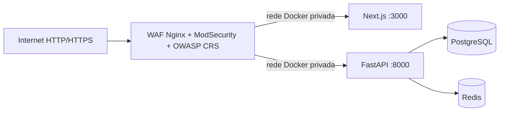

# WAF do Hotel Real Cabo Frio

## Estado

O WAF esta integrado ao `docker-compose.production.yml`, testado localmente e
configurado para iniciar em observacao. Ele **nao foi implantado nem ativado na
VPS** por esta alteracao.

Imagem fixada por versao e digest:

```text
owasp/modsecurity-crs:4.28.0-nginx-202607100407@sha256:caa33403214c6898c68b78707a729674bf718ef834ea7834433a30dbc6b17b26
```

## Arquitetura



Somente o WAF publica `80/443`. As portas do backend e frontend ficam presas a
`127.0.0.1`, impedindo o desvio externo do filtro. O TLS termina no WAF para que
o trafego HTTPS possa ser inspecionado.

## Protecoes implementadas

| Risco | Controle |
|---|---|
| SQL injection, XSS, RCE, LFI/RFI e violacoes HTTP | ModSecurity + OWASP Core Rule Set |
| Scanners e bots ofensivos declarados | bloqueio de User-Agent conhecido e rate limiting |
| IP ou rede maliciosa conhecida | denylist local IPv4/IPv6 por CIDR |
| Tentativas em `.env`, `.git`, phpMyAdmin e caminhos similares | regra local com `403` |
| Path traversal | regra local e cobertura adicional do CRS |
| Forca bruta e abuso | limites distintos para login, OTP, uploads, API, TEF e webhooks |
| IP forjado em `X-Forwarded-For` | header do cliente e sobrescrito pelo WAF |
| Bypass direto | origens publicadas apenas no loopback do host |
| Vazamento em access log | JSON por classe de rota, sem path, query string, body, Referer ou Authorization |
| Host desconhecido e metodos indevidos | `444` para host desconhecido; `405` para metodo nao permitido |

As excecoes para comprovantes, senhas e TEF sao limitadas a rota, campo e/ou
regra especifica. Elas nao desligam o WAF para o endpoint inteiro.

## Primeiro deploy: observacao

Confirme no `.env.production`:

```dotenv
WAF_SERVER_NAME=hotelrealcabofrio.com
SSL_CERT_PATH=/caminho/real/fullchain.pem
SSL_KEY_PATH=/caminho/real/privkey.pem
WAF_MODE=DetectionOnly
WAF_RATE_LIMIT_DRY_RUN=on
WAF_BLOCKING_PARANOIA=1
WAF_DETECTION_PARANOIA=2
```

O certificado e a chave precisam existir, corresponder ao dominio e ser
legiveis pelo UID/GID `101` usado pela imagem. Uma opcao segura na VPS e manter
uma copia estavel em `/etc/hotel-waf/tls`, com diretorio `0750`, arquivos
pertencentes a `root:101`, certificado `0644` e chave `0640`. Nao use o
certificado autoassinado do repositorio em producao e nao monte diretamente um
arquivo versionado `archive/*1.pem`.

O hook de renovacao do Certbot deve atualizar `fullchain.pem` e `privkey.pem`
nesse diretorio, preservar as permissoes e recriar `nginx-proxy`. Como o Compose
monta os dois arquivos individualmente, uma troca atomica por `rename` pode
deixar o container preso ao inode antigo; apenas `nginx -s reload` nao e
garantia de renovacao. Use `up -d --force-recreate nginx-proxy` para refazer os
bind mounts. Sem esse hook, a renovacao do Let's Encrypt nao e propagada ao WAF.

Valide antes de alterar containers:

```powershell
docker compose --env-file .env.production -f docker-compose.production.yml config --quiet
& .\waf\tests\test-waf.ps1
```

Ao testar comprovante grande com `curl`, envie `-H "Expect:"`. O CRS bloqueia
`Expect: 100-continue` por politica de protocolo; navegadores/Axios nao enviam
esse header no fluxo atual.

Com backup confirmado e janela operacional aprovada, o comando de implantacao
e:

```powershell
docker compose --env-file .env.production -f docker-compose.production.yml pull nginx-proxy
docker compose --env-file .env.production -f docker-compose.production.yml up -d --build --force-recreate backend frontend nginx-proxy
```

Esse comando reinicia servicos; nao o execute sem autorizacao operacional.
Depois, valide:

```powershell
curl.exe --fail --silent --show-error https://hotelrealcabofrio.com/healthz
docker compose --env-file .env.production -f docker-compose.production.yml ps
docker compose --env-file .env.production -f docker-compose.production.yml logs --since 10m nginx-proxy
```

Em `DetectionOnly`, o CRS registra anomalias sem executar suas acoes
disruptivas. Bloqueios estruturais do Nginx, como host desconhecido, denylist,
scanner declarado e metodo invalido, continuam ativos.

## Ativar o bloqueio

Observe trafego real por 48 a 72 horas, cubra reservas, login, OTP, Jornada
Real, comprovantes, TEF, Cielo e Twilio e corrija apenas falsos positivos
comprovados. Entao altere:

```dotenv
WAF_MODE=On
WAF_RATE_LIMIT_DRY_RUN=off
```

Recrie somente o proxy:

```powershell
docker compose --env-file .env.production -f docker-compose.production.yml up -d --force-recreate nginx-proxy
```

Rollback imediato, sem remover a camada TLS/proxy:

```dotenv
WAF_MODE=DetectionOnly
WAF_RATE_LIMIT_DRY_RUN=on
```

Depois recrie novamente apenas `nginx-proxy`.

## Bloquear IP ou rede

Edite `waf/ip-blocklist.conf` usando o formato do modulo `geo`:

```nginx
198.51.100.25 1;
203.0.113.0/24 1;
2001:db8:1234::/48 1;
```

Como a denylist tambem e um bind de arquivo individual, valide em um container
novo e recrie o proxy para garantir que uma gravacao por `rename` seja vista:

```powershell
docker compose --env-file .env.production -f docker-compose.production.yml run --rm --no-deps nginx-proxy nginx -t
docker compose --env-file .env.production -f docker-compose.production.yml up -d --force-recreate nginx-proxy
```

Registre motivo, fonte, responsavel e data de expiracao de cada bloqueio. Para
reputacao automatica e bot management completo, use uma segunda camada
controlada, como CrowdSec ou um provedor de borda; o CRS sozinho nao oferece
uma base global de reputacao de IP.

## Logs e tuning

Os eventos saem em JSON por `stdout`, com rotacao Docker de `20 MiB x 5`.
O access log operacional do WAF registra apenas a classe da rota e nao registra
path, query, body, Referer ou Authorization. O access log do Uvicorn/Gunicorn
fica desativado porque o `UvicornWorker` ignora o formato customizado do
Gunicorn e voltaria a gravar a request line completa. Logs de erro continuam
ativos.

O audit log do ModSecurity ainda pode conter URI, query e trechos que dispararam
uma regra; trate-o como dado sensivel, restrinja acesso e aplique retencao
curta. A garantia de redacao acima vale para o access log operacional, nao para
eventos de seguranca do ModSecurity.

Regras locais ficam em `waf/rules/hotel-before.conf`. Para falso positivo,
prefira exclusao por rota e campo. Nunca remova globalmente as categorias SQLi
ou XSS apenas para silenciar um alerta.

## Limites desta camada

- O WAF protege HTTP/HTTPS; nao protege SSH, PostgreSQL ou Redis.
- Ele nao substitui validacao e autorizacao no backend.
- Ele nao absorve DDoS volumetrico que sature o link da VPS.
- A firewall da VPS deve publicar somente `80/443` e SSH restrito; `3000/8000`,
  PostgreSQL e Redis nao devem estar acessiveis pela Internet.
- A assinatura `X-Twilio-Signature` ainda deve ser validada no backend; o WAF
  nao autentica a origem funcional do webhook. A rota Twilio tambem possui logs
  aplicativos preexistentes com telefone/SID/body que exigem saneamento em uma
  tarefa propria antes de declarar conformidade integral de logs.
- A origem Cielo continua dependendo da allowlist e do modo configurados no
  backend; rate limit/CRS nao substituem autenticacao do provedor.
- `FORWARDED_ALLOW_IPS="*"` pressupoe que a rede Docker e os processos locais
  sejam confiaveis. Essa configuracao so e aceitavel enquanto `8000` permanecer
  no loopback e o WAF sobrescrever `X-Forwarded-For`; ao adicionar outro proxy
  ou container nao confiavel, restrinja a lista aos IPs/CIDRs exatos.

## Referencias oficiais

- [Imagem oficial OWASP CRS + ModSecurity](https://github.com/coreruleset/modsecurity-crs-docker)
- [Tuning e falsos positivos do CRS](https://coreruleset.org/docs/2-how-crs-works/2-3-false-positives-and-tuning/)
- [Paranoia levels](https://coreruleset.org/docs/2-how-crs-works/2-2-paranoia_levels/)
- [Anomaly scoring](https://coreruleset.org/docs/2-how-crs-works/2-1-anomaly_scoring/)
- [Rate limiting do Nginx](https://nginx.org/en/docs/http/ngx_http_limit_req_module.html)
- [Rotacao de logs Docker](https://docs.docker.com/engine/logging/drivers/json-file/)
