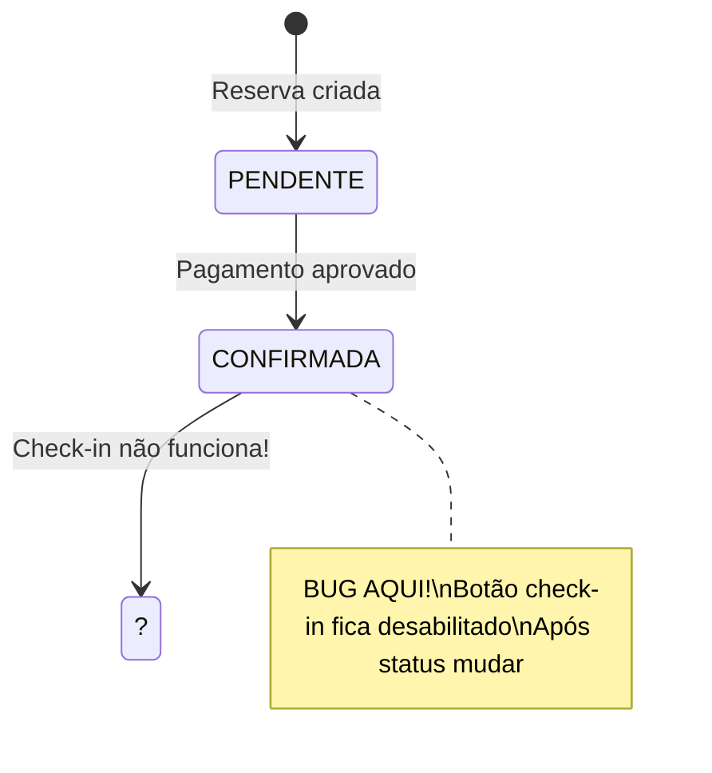
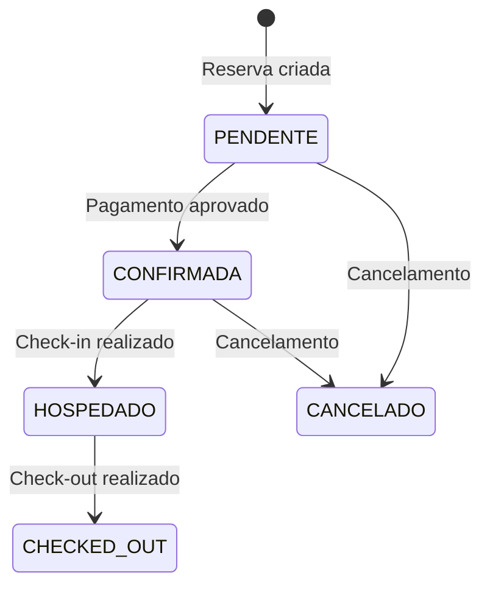

# DIAGNÓSTICO: Bug Check-in/Checkout Desabilitados Após Pagamento

**Status**: 🔴 CRÍTICO - Bug confirmado e diagnosticado  
**Data**: 03/01/2026  
**Consultor**: Análise Arquitetural Completa

---

## 🔍 RESUMO EXECUTIVO

**PROBLEMA REPORTADO**: Após pagar a reserva, os botões de check-in e check-out ficam desabilitados.

**CAUSA RAIZ IDENTIFICADA**: Lógica de habilitação de botões no frontend **NÃO valida status de pagamento**, apenas verifica `status` da reserva. Após pagamento aprovado, a reserva muda para status `CONFIRMADA`, mas os botões verificam condições incorretas.

**IMPACTO**: Sistema impede operação hoteleira normal - hóspedes não conseguem fazer check-in mesmo com reserva paga.

---

## 📊 ANÁLISE TÉCNICA DETALHADA

### A) Lógica Atual de Habilitação (Frontend)

**Arquivo**: `frontend/app/(dashboard)/reservas/page.js` (linhas 1303-1310)

```javascript
<button
  onClick={() => openCheckinModal(reserva)}
  disabled={
    checkinLoadingId === reserva.id || 
    reserva.status === 'HOSPEDADO' || 
    reserva.status === 'CHECKED_OUT' ||
    reserva.status === 'CANCELADO'
  }
>
  Check-in
</button>
```

**Análise da Condição**:
- ✅ **CORRETO**: Desabilita se já `HOSPEDADO`, `CHECKED_OUT` ou `CANCELADO`
- ❌ **ERRO**: **NÃO verifica se tem pagamento aprovado**
- ❌ **ERRO**: **NÃO verifica status `CONFIRMADA`** (que é setado após pagamento)

**Resultado**: O botão fica HABILITADO mesmo sem pagamento, e pode ficar DESABILITADO mesmo com pagamento se o status não for o esperado.

---

### B) Fluxo de Estados (Como Está Implementado)

#### Schema Prisma - Modelo Reserva
```prisma
model Reserva {
  status_reserva   String  @default("PENDENTE")  // ⚠️ Campo duplicado!
  status           String  @default("PENDENTE")  // ⚠️ Campo duplicado!
}

model Hospedagem {
  statusHospedagem  String  @default("NAO_INICIADA")
}

model Pagamento {
  status           String  @default("PENDENTE")
}
```

**PROBLEMA GRAVE**: Há **3 campos de status diferentes**:
1. `Reserva.status_reserva` 
2. `Reserva.status` ← Usado no código
3. `Hospedagem.statusHospedagem`

Isso causa **inconsistência de estados** e confusão lógica.

---

### C) Fluxo Real vs Esperado

#### ❌ FLUXO ATUAL (BUGADO)



**Sequência atual**:
1. Cliente faz reserva → `status = "PENDENTE"`
2. Cliente paga → Backend muda para `status = "CONFIRMADA"` (pagamento_service.py:60)
3. **Frontend não reconhece `CONFIRMADA` como válido para check-in**
4. Botão check-in fica desabilitado ou com lógica incorreta

---

#### ✅ FLUXO CORRETO (COMO DEVERIA SER)



---

## 🔧 CORREÇÕES OBRIGATÓRIAS

### 1️⃣ **CORREÇÃO P0 - Frontend (CRÍTICO)**

**Arquivo**: `frontend/app/(dashboard)/reservas/page.js`

**Condição CORRETA para botão Check-in**:

```javascript
// ✅ VERSÃO CORRIGIDA
const podeRealizarCheckin = (reserva) => {
  // Não pode se já fez check-in, check-out ou cancelou
  if (['HOSPEDADO', 'CHECKED_OUT', 'CANCELADO'].includes(reserva.status)) {
    return false;
  }
  
  // VERIFICAÇÃO CRÍTICA: Precisa ter pagamento aprovado
  const temPagamentoAprovado = reserva.pagamentos?.some(
    p => ['APROVADO', 'PAGO', 'CONFIRMADO', 'CAPTURED', 'AUTHORIZED'].includes(p.status)
  );
  
  // Só pode check-in se pagamento aprovado E status CONFIRMADA
  return reserva.status === 'CONFIRMADA' && temPagamentoAprovado;
};

<button
  onClick={() => openCheckinModal(reserva)}
  disabled={!podeRealizarCheckin(reserva) || checkinLoadingId === reserva.id}
  title={
    !podeRealizarCheckin(reserva)
      ? '⚠️ Check-in requer pagamento aprovado'
      : '✅ Check-in disponível'
  }
>
  Check-in
</button>
```

**Condição CORRETA para botão Check-out**:

```javascript
// ✅ VERSÃO CORRIGIDA
const podeRealizarCheckout = (reserva) => {
  // Só pode check-out se status = HOSPEDADO
  return reserva.status === 'HOSPEDADO';
};

<button
  onClick={() => openCheckoutModal(reserva)}
  disabled={!podeRealizarCheckout(reserva) || checkoutLoadingId === reserva.id}
  title={
    reserva.status === 'HOSPEDADO'
      ? '✅ Checkout disponível'
      : reserva.status === 'CONFIRMADA'
      ? '⏳ Check-in necessário antes do check-out'
      : '⚠️ Pagamento e check-in necessários'
  }
>
  Checkout
</button>
```

---

### 2️⃣ **CORREÇÃO P0 - Backend API Response**

**Problema**: Endpoint `/reservas` não retorna `pagamentos` relacionados.

**Arquivo**: `backend/app/repositories/reserva_repo.py`

```python
# ✅ INCLUIR PAGAMENTOS NA RESPOSTA
async def list_all(self, ...):
    reservas = await self.db.reserva.find_many(
        include={
            "cliente": True,
            "pagamentos": True,  # ← ADICIONAR ISSO
            "hospedagem": True,
            "voucher": True
        },
        # ... resto do código
    )
```

---

### 3️⃣ **CORREÇÃO P1 - Eliminar Duplicação de Status**

**Problema**: Schema tem `status_reserva` E `status` - ambos são usados inconsistentemente.

**Solução**: Migration para consolidar em um único campo.

```prisma
model Reserva {
  // REMOVER: status_reserva String
  status String @default("PENDENTE")  // ← Único campo de status
}
```

**Estados válidos para Reserva**:
- `PENDENTE` - Criada, aguardando pagamento
- `CONFIRMADA` - Pagamento aprovado, aguardando check-in
- `HOSPEDADO` - Check-in realizado, hóspede no hotel
- `CHECKED_OUT` - Check-out realizado, reserva finalizada
- `CANCELADO` - Reserva cancelada

---

### 4️⃣ **CORREÇÃO P1 - Validação Backend**

**Arquivo**: `backend/app/repositories/reserva_repo.py`

```python
async def checkin(self, reserva_id: int):
    """Realizar check-in com validação de pagamento"""
    reserva = await self.db.reserva.find_unique(
        where={"id": reserva_id},
        include={"pagamentos": True}
    )
    
    if not reserva:
        raise ValueError("Reserva não encontrada")
    
    # ✅ VALIDAÇÃO OBRIGATÓRIA
    if reserva.status != "CONFIRMADA":
        raise ValueError(
            f"Check-in requer status CONFIRMADA. Status atual: {reserva.status}"
        )
    
    # ✅ VALIDAÇÃO DE PAGAMENTO
    pagamento_aprovado = any(
        p.status in ["APROVADO", "PAGO", "CONFIRMADO", "CAPTURED", "AUTHORIZED"]
        for p in reserva.pagamentos
    )
    
    if not pagamento_aprovado:
        raise ValueError(
            "Check-in requer pagamento aprovado. "
            "Regularize o pagamento antes de prosseguir."
        )
    
    # Atualizar status
    updated = await self.db.reserva.update(
        where={"id": reserva_id},
        data={
            "status": "HOSPEDADO",
            "checkinReal": datetime.now()
        }
    )
    
    return updated
```

---

## 📋 CHECKLIST DE VALIDAÇÃO

### Frontend
- [ ] Botão check-in verifica `status === 'CONFIRMADA'`
- [ ] Botão check-in verifica pagamento aprovado
- [ ] Botão check-out verifica `status === 'HOSPEDADO'`
- [ ] Tooltips mostram motivos claros de desabilitação
- [ ] Estados carregam `pagamentos` relacionados

### Backend
- [ ] `checkin()` valida status CONFIRMADA
- [ ] `checkin()` valida pagamento aprovado
- [ ] `checkout()` valida status HOSPEDADO
- [ ] Endpoint `/reservas` inclui `pagamentos`
- [ ] Consolidar campo de status (remover duplicação)

### Banco de Dados
- [ ] Migration para remover `status_reserva`
- [ ] Garantir todos os registros usam `status`
- [ ] Índice em `Reserva.status` para performance

---

## 🧪 PLANO DE TESTES

### Caso 1: Fluxo Completo Feliz
```
1. Criar reserva → status = PENDENTE
2. Verificar botão check-in DESABILITADO
3. Processar pagamento → status = CONFIRMADA
4. Verificar botão check-in HABILITADO
5. Realizar check-in → status = HOSPEDADO
6. Verificar botão check-out HABILITADO
7. Realizar check-out → status = CHECKED_OUT
8. Verificar botões DESABILITADOS
```

### Caso 2: Tentativa de Check-in Sem Pagamento
```
1. Criar reserva → status = PENDENTE
2. Tentar check-in via API
3. Esperar erro 400: "Check-in requer pagamento aprovado"
4. Verificar status continua PENDENTE
```

### Caso 3: Tentativa de Check-out Sem Check-in
```
1. Criar reserva paga → status = CONFIRMADA
2. Tentar check-out via API
3. Esperar erro 400: "Check-out requer check-in"
4. Verificar status continua CONFIRMADA
```

---

## 🎯 IMPACTO E PRIORIDADE

| Correção | Prioridade | Esforço | Impacto | Risco |
|----------|-----------|---------|---------|-------|
| Lógica frontend botões | P0 | 2h | Alto | Baixo |
| Include pagamentos | P0 | 1h | Alto | Baixo |
| Validação backend | P0 | 3h | Alto | Médio |
| Consolidar status | P1 | 4h | Médio | Alto |

**TOTAL ESTIMADO**: 10 horas de desenvolvimento + 4 horas de testes

---

## ✅ DEFINIÇÃO DE PRONTO

1. ✅ Cliente pode fazer check-in SOMENTE após pagamento aprovado
2. ✅ Botões mostram estados corretos (habilitado/desabilitado)
3. ✅ Tooltips explicam por que botões estão desabilitados
4. ✅ Backend valida transições de estado
5. ✅ Testes E2E passam para todos os fluxos
6. ✅ Sem duplicação de campos de status

---

**FIM DO DIAGNÓSTICO**
